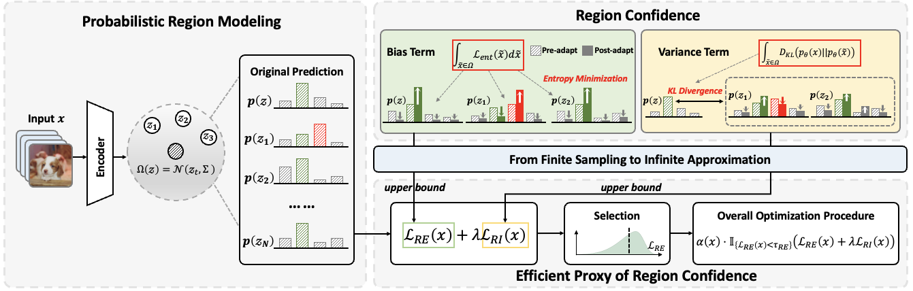

# SaTeen: Learning Structural Alignment for Continual Test-Time Adaptation

This repository contains the official code for the paper **SaTeen: Learning Structural Alignment for Continual Test-Time Adaptation**.

SaTeen is a test-time adaptation method designed for distribution shifts that evolve over time. This codebase focuses on evaluation under ImageNet-C corruptions with both standard test-time adaptation and continual / online adaptation settings.



## Highlights

- Supports the following adaptation methods in one codebase:
  - `no_adapt`
  - `tent`
  - `eata`
  - `sar`
  - `deyo`
  - `recap_plpd`
  - `sateen`
- Supports two backbones:
  - `resnet50_gn_timm`
  - `vitbase_timm`
- Supports multiple evaluation settings:
  - standard corruption-wise testing
  - mixed corruption stream
  - batch-size-1 online adaptation
  - label distribution shifts

## Repository Structure

```text
SaTeen/
|-- main.py                         # corruption-wise evaluation / adaptation entry
|-- main_c.py                       # continual evaluation entry
|-- sateen.py                       # SaTeen implementation
|-- tent.py / eata.py / sar.py
|-- deyo.py / recap.py / recap_plpd.py
|-- dataset/
|   |-- selectedRotateImageFolder.py
|   |-- generate_shifted_sample_indices.py
|   `-- total_100000_ir_500000_class_order_shuffle_yes.npy
|-- models/
|   `-- Res.py
|-- utils/
|   |-- cli_utils.py
|   |-- utils.py
|   |-- cov_resnet50_gn_timm.npy
|   `-- cov_vitbase_timm.npy
`-- figures/
    `-- overview.png
```

## Environment

The code was written for the following environment:

- Python 3.9
- CUDA 11.8
- PyTorch 2.3.1
- torchvision 0.18.1

Recommended setup:

```bash
conda create -n sateen python=3.9 -y
conda activate sateen

pip install torch==2.3.1 torchvision==0.18.1 torchaudio==2.3.1 --index-url https://download.pytorch.org/whl/cu118
pip install pycm matplotlib einops timm scikit-learn pillow numpy
```

## Data Preparation

This repository evaluates on **ImageNet-C**.

### 1. Download ImageNet-C

- Paper: https://arxiv.org/abs/1903.12261
- Download page: https://github.com/hendrycks/robustness

### 2. Organize the dataset

Set `--data_corruption` to the root directory of ImageNet-C. The expected structure is:

```text
/path/to/imagenet-c/
|-- gaussian_noise/
|   |-- 1/
|   |-- 2/
|   |-- 3/
|   |-- 4/
|   `-- 5/
|-- shot_noise/
|-- impulse_noise/
...
`-- jpeg_compression/
```

If you also want to use the clean ImageNet validation set, set `--data` to the standard ImageNet root:

```text
/path/to/imagenet/
|-- train/
`-- val/
```

## Pretrained Weights

The code expects local pretrained weights for the backbones:

- `./models/resnet50_gn_a1h2-8fe6c4d0.pth`
- `./models/B_16-i21k-300ep-lr_0.001-aug_medium1-wd_0.1-do_0.0-sd_0.0--imagenet2012-steps_20k-lr_0.01-res_224.npz`
- optionally `./models/resnet50-19c8e357.pth` if you use `resnet50_bn_torch`

Please place the corresponding files under the `models/` directory before running experiments.

## Running Experiments

### 1. Standard corruption-wise evaluation

`main.py` evaluates each corruption stream separately.

```bash
python main.py \
  --data_corruption /path/to/imagenet-c \
  --exp_type normal \
  --method sateen \
  --model resnet50_gn_timm \
  --output ./exps
```

### 2. Continual evaluation

`main_c.py` is used for continual / continuous adaptation settings.

```bash
python main_c.py \
  --data_corruption /path/to/imagenet-c \
  --exp_type normal \
  --method sateen \
  --model resnet50_gn_timm \
  --output ./exps
```

### 3. Common examples

```bash
# ResNet-50-GN
python main.py   --data_corruption /path/to/imagenet-c --exp_type normal       --method sateen --model resnet50_gn_timm
python main.py   --data_corruption /path/to/imagenet-c --exp_type mix_shifts   --method sateen --model resnet50_gn_timm
python main.py   --data_corruption /path/to/imagenet-c --exp_type label_shifts --method sateen --model resnet50_gn_timm
python main.py   --data_corruption /path/to/imagenet-c --exp_type bs1          --method sateen --model resnet50_gn_timm

# ViT-B/16
python main.py   --data_corruption /path/to/imagenet-c --exp_type normal       --method sateen --model vitbase_timm
python main.py   --data_corruption /path/to/imagenet-c --exp_type mix_shifts   --method sateen --model vitbase_timm
python main.py   --data_corruption /path/to/imagenet-c --exp_type label_shifts --method sateen --model vitbase_timm
python main.py   --data_corruption /path/to/imagenet-c --exp_type bs1          --method sateen --model vitbase_timm

# Continual setting
python main_c.py --data_corruption /path/to/imagenet-c --exp_type normal       --method sateen --model resnet50_gn_timm
python main_c.py --data_corruption /path/to/imagenet-c --exp_type normal       --method sateen --model vitbase_timm
python main_c.py --data_corruption /path/to/imagenet-c --exp_type label_shifts --method sateen --model resnet50_gn_timm
python main_c.py --data_corruption /path/to/imagenet-c --exp_type label_shifts --method sateen --model vitbase_timm
```

## Important Arguments

### Shared arguments

- `--data`: clean ImageNet root, default `./data/imagenet`
- `--data_corruption`: ImageNet-C root, default `./data/imagenet-c`
- `--output`: directory for logs and results
- `--gpu`: GPU id
- `--seed`: random seed
- `--test_batch_size`: test batch size
- `--level`: corruption severity level, default `5`
- `--corruption`: corruption type, default `gaussian_noise`

### Experiment type

`--exp_type` supports:

- `normal`: standard test-time adaptation on one corruption at a time
- `mix_shifts`: concatenates all 15 ImageNet-C corruptions into one mixed stream
- `bs1`: online adaptation with batch size 1
- `label_shifts`: online imbalanced label-distribution shift setting

### Method

`--method` supports:

- `no_adapt`
- `tent`
- `eata`
- `sar`
- `deyo`
- `recap_plpd`
- `sateen`

### Backbone

`--model` supports:

- `resnet50_gn_timm`
- `vitbase_timm`
- `resnet50_bn_torch`

## Label Shift Setting

For `--exp_type label_shifts`, the repository already includes one predefined sample-order file:

- `dataset/total_100000_ir_500000_class_order_shuffle_yes.npy`

The imbalance ratio is controlled by `--imbalance_ratio`. In the current code:

- when `seed=2024`, `main.py` and `main_c.py` look for
  `./dataset/total_100000_ir_{imbalance_ratio}_class_order_shuffle_yes.npy`
- otherwise they look for
  `./dataset/seed{seed}_total_100000_ir_{imbalance_ratio}_class_order_shuffle_yes.npy`

If you need other imbalance ratios or seeds, use:

```bash
python dataset/generate_shifted_sample_indices.py
```

and save the generated `.npy` file under `dataset/` using the naming convention expected by the code.

## Notes

- `main.py` and `main_c.py` are not identical; some method hyper-parameters differ slightly across the two entry scripts.
- The current implementation scales several thresholds internally by `log(num_classes)`, so the command-line defaults are intentionally given in normalized form.
- `utils/cov_resnet50_gn_timm.npy` and `utils/cov_vitbase_timm.npy` are required by the ReCAP-based methods.
- The codebase assumes CUDA is available for the main experiments.

## Acknowledgment

This repository builds on excellent prior work, especially:

- SAR
- DeYO
- ReCAP

Thanks to the original authors for making their code available.

## License

This project is released under the BSD 3-Clause License. See [LICENSE](LICENSE) for details.
